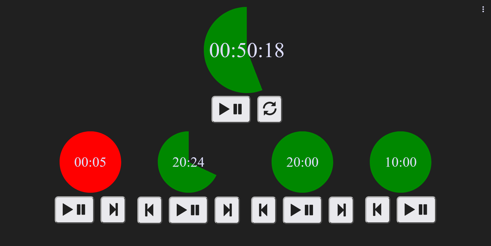
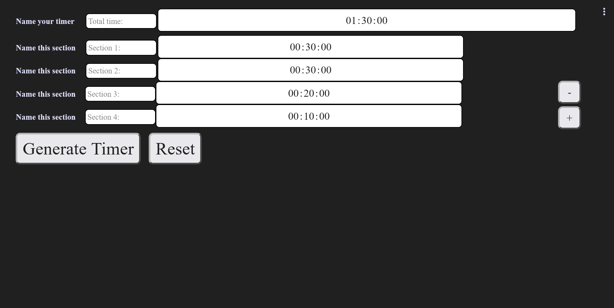
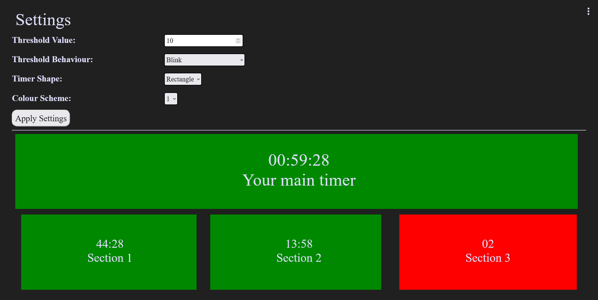

# Overflow Presentation Timer

by Ruben du Pon

Main timer screen: | Setting a timer: | Settings screen:
-------------------|------------------|------------------
 | | 

## What is the Overflow Presentation Timer?

The overflow Presentation Timer is a timer with subtimers. When a subtimer reaches 0 it will show a red background 
and start counting up. This way you will know when you took longer than planned for one of your sections, and how 
much time you will need to make up in the rest of your presentation. If you struggle with a sense of time, this can be 
very useful! This timer is designed for anyone who needs to keep track of the time they have for their sections. While 
it is mainly designed for a presentation or educational context, it can be used in many different ways! Subtimers can 
even be run simultaneously, for use in for instance a kitchen, where you have a main dish and different side dishes, or 
a certain amount of time to make all the dishes for one table.

## How does it work?

Simple, just open the app, click the link or go to set timer from the menu, and enter
the time of your main timer and sub timers. You can name your timers as well, to help
you keep track of which timer is counting what. Add subtimers as much as you need.
When you're done, click on "Generate Timer" and your timer is ready to be used!
When you click the play/pause button on the main timer, both it and the first subtimer
will start automatically. To go to the next subtimer, simply click the next button.
If you made a mistake and went to the next timer too early, you can click the previous
button to go back. If you want to start a subtimer without stopping the previous one
you can click the play/pause button on any of the subtimers to start them immediately.

## Watch a video here

https://github.com/minprog-platforms/project-Ruben-du-Pon/assets/151724616/2ead293e-d424-46a9-af2e-dd38dbd95bcf

