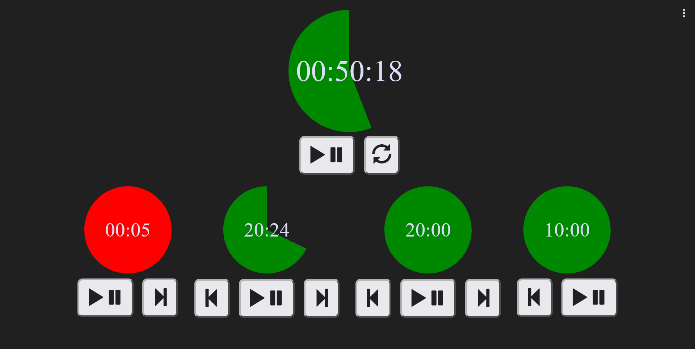
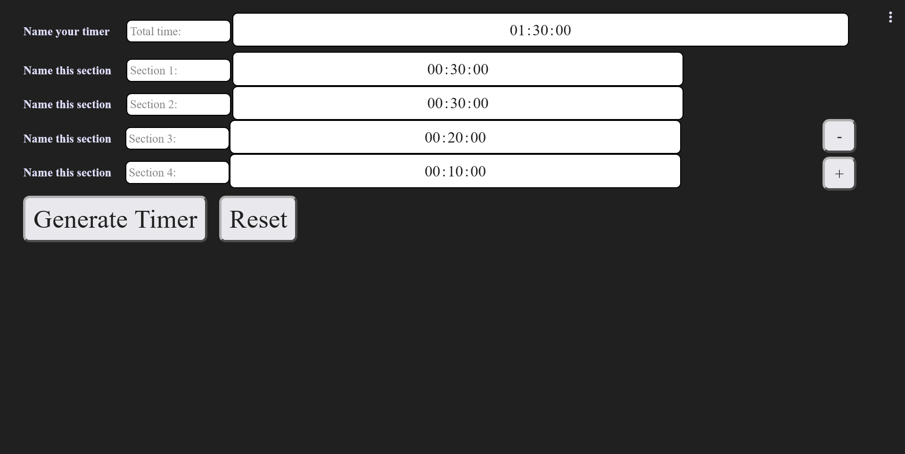
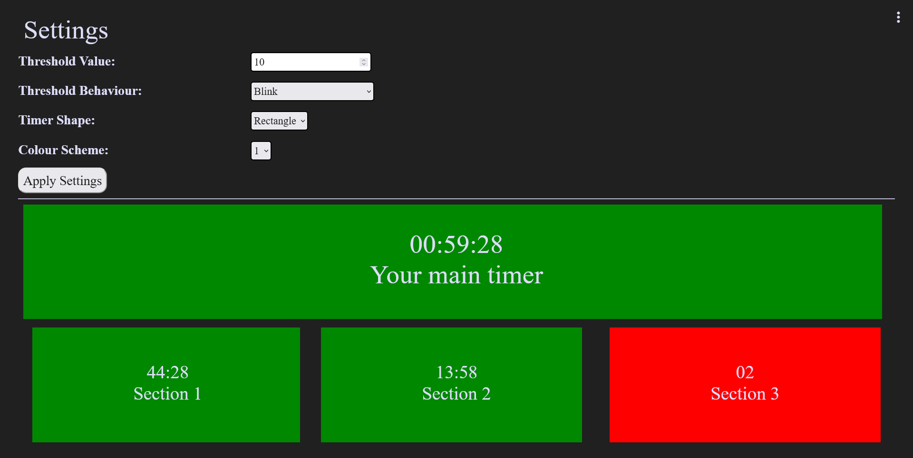

# Overflow Presentation Timer

*by Ruben du Pon*

A web-based timer with subtimers that turn red and count upward when their time limit is exceeded — so you always know exactly how far over you are and how much time you need to make up.

| Main timer | Set a timer | Settings |
|:---:|:---:|:---:|
|  |  |  |

## Features

- **Overflow tracking** — when a subtimer hits 0, it flips to a red background and starts counting up, showing exactly how much time you've gone over
- **Named timers** — label each subtimer to keep track of your sections at a glance
- **Sequential or simultaneous subtimers** — step through subtimers one by one, or start any subtimer independently at any time
- **Navigate freely** — jump forward and backward between subtimers if you need to adjust on the fly
- **Flexible use cases** — designed for presentations and teaching, but works for anything with timed sections (cooking, workshops, meetings, etc.)

## Demo

https://github.com/minprog-platforms/project-Ruben-du-Pon/assets/151724616/2ead293e-d424-46a9-af2e-dd38dbd95bcf

## Getting Started

### Prerequisites

- Python 3.x
- pip

### Installation

1. Clone the repository:
   ```bash
   git clone https://github.com/Ruben-du-Pon/Timer.git
   cd Timer
   ```

2. Install dependencies:
   ```bash
   pip install -r requirements.txt
   ```

3. Set up environment variables by creating a `.env` file in the project root:
   ```
   SECRET_KEY=your_secret_key_here
   ```

4. Run the app:
   ```bash
   flask run
   ```

5. Open your browser and go to `http://127.0.0.1:5000`

## How to Use

1. From the home screen, click the link or navigate to **Set Timer** in the menu.
2. Enter the duration for your main timer and add as many subtimers as you need.
3. Give each timer a name to help you track your sections.
4. Click **Generate Timer** when you're done — your timer is ready!
5. Press the **play/pause** button on the main timer to start both it and the first subtimer simultaneously.
6. Use the **next** and **previous** buttons to move between subtimers in order.
7. To start a subtimer independently without stopping the current one, press its own **play/pause** button directly.

## Tech Stack

| Component | Technology |
|---|---|
| Backend | [Flask](https://flask.palletsprojects.com/) |
| Database | [SQLAlchemy](https://www.sqlalchemy.org/) + [Flask-SQLAlchemy](https://flask-sqlalchemy.palletsprojects.com/) |
| Sessions | [Flask-Session](https://flask-session.readthedocs.io/) |
| Frontend | JavaScript, CSS, HTML |
| Environment | [python-dotenv](https://pypi.org/project/python-dotenv/) |

## License

This project is licensed under the [GNU AGPL-3.0 License](LICENSE).
